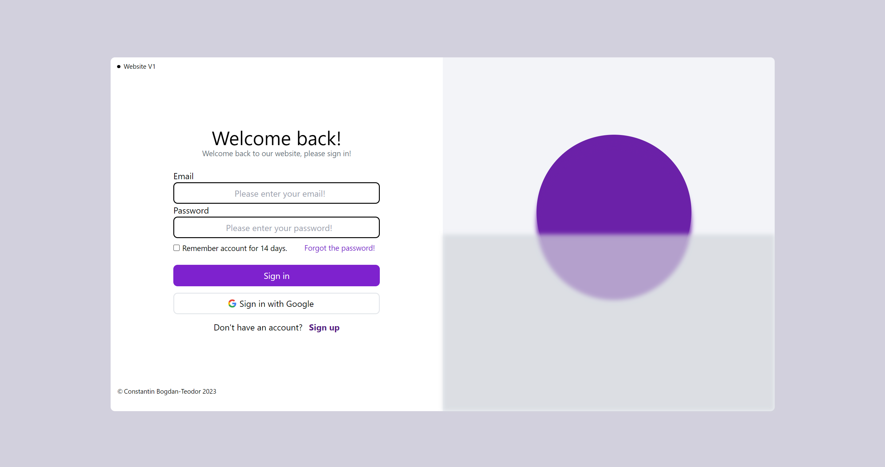

# First project on github
This project it's the my first project uploaded on github, more will come.

This project was made using HTML, CSS ( Tailwind framework ) and Javascript.

This project it's small. I made a login and register system, just the frontend side. The project will be updated using the backend side. But for the moment just the frontend was uploaded.

And a nice frontend for the main saction. Nothing more to see.

## Requirements

This project need:
- Tailwind (https://tailwindcss.com/docs/installation)

## Photos

### Login

### Register

### Main

